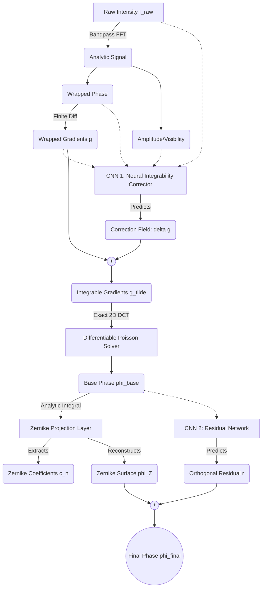

# Plan 021: Comprehensive Scientific Blueprint — Physics State Space Network (PSSN) for Optics Express

> **Status:** `TODO`  
> **Priority:** P1  
> **Effort:** M–L  
> **Target Journal:** Optics Express (Optica Publishing Group)  
> **Audience:** External Peer Reviewers, Journal Editors, & Project Collaborators  
> **Foundational Document:** Built upon [Plan 020](020-pinn-offaxis-optics-express-pipeline.md) (The Optical Forward Model & Off-Axis Injection)

---

## EXECUTIVE SUMMARY FOR REVIEWERS

This document specifies a paradigm-shifting deep learning architecture for interferometric phase unwrapping. Building directly upon the physical forward model established in **Plan 020**, we evolve our approach from a standard Physics-Informed Neural Network (PINN) to a **Physics State Space Network (PSSN)**. 

The core conceptual leap is recognizing that deterministic physical algorithms (like the classical Poisson solver) fail catastrophically when fed inconsistent data (noisy, non-integrable phase gradients). Instead of attempting to use a Convolutional Neural Network (CNN) to "clean up" the heavily distorted phase *after* the Poisson solver fails, our PSSN deploys lightweight CNNs directly inside the physical latent space to correct the gradients *before* they are integrated. 

Coupled with a mathematically rigorous Zernike-orthogonal residual decomposition and complex-domain consistency losses, this framework represents a highly robust, reviewer-proof manuscript strategy for **Optics Express**.

---

## 1. FOUNDATION: THE OPTICAL FORWARD MODEL (From Plan 020)

We retain the exact, rigorous physical model defined in Plan 020, derived from the laboratory MATLAB script:

- **Interferometer:** Helium-Neon ($\lambda = 632.8\text{ nm}$) Mach-Zehnder.
- **Sensor:** $128 \times 128$ grid, pixel pitch $\Delta x \approx 15.75 \, \mu\text{m}$.
- **Reference Beam ($\phi_2$):** Diverging spherical wave ($z_2 = 0.5\text{ m}$) with variable tilt $\alpha$.
- **Object Beam ($\phi_1$):** Spherical curvature plus low-order polynomial (Zernike-like) aberrations.

### Enhancement to the Forward Model (New for Plan 021):
**Multiplicative Speckle Noise:** Real interferometers are governed by laser speckle. We upgrade the generator to simulate physical multiplicative noise:
$$I(x,y) = A(x,y)\left[ 1 + V(x,y)\cos(\Delta\phi(x,y)) \right] + \eta$$
where $A(x,y)$ contains random speckle intensity variations.

---

## 2. THE PARADIGM SHIFT: WHY WE ABANDONED POST-PHYSICS CORRECTION

Plan 020 proposed a powerful idea: 
`[Analytic Signal] -> [Poisson Solver] -> [CNN]`

However, advanced red-team analysis revealed critical mathematical failure modes in this topology:

1. **Information Destruction:** The Analytic Signal stem's Fourier bandpass is not injective; it permanently deletes high-frequency features. If the CNN only sees the deterministic output, it cannot recover the lost frequencies.
2. **Poisson Inconsistency:** The classical Least-Squares Poisson solver assumes the wrapped gradient field $\mathbf{g}$ is perfectly integrable ($\nabla \times \mathbf{g} = 0$). When noise causes phase residues (branch points), $\nabla \times \mathbf{g} \neq 0$. The DCT solver then solves the *wrong PDE*, smearing a local residue error globally across the entire image. A CNN placed *after* this step is forced to learn how to undo complex global smearing, rather than simply unwrapping phase.
3. **Zernike / Pixel Conflict:** Using a Global Average Pooling (GAP) layer to predict Zernike coefficients destroys spatial moments (you cannot tell left-coma from right-coma if you average the image). Furthermore, independent pixel and Zernike heads compete against each other to explain the same low-frequency structures.

---

## 3. THE SOLUTION: PHYSICS STATE SPACE NETWORK (PSSN)

We restructure the architecture so the CNN operates strictly as a corrector of physical state variables, rather than an arbitrary image-to-image mapper.

### Flowchart

---

## 4. DEEP DIVE: THE MATHEMATICAL MODULES

### Module 1: The Neural Integrability Corrector (Gradient Space)
Instead of forcing the CNN to output phase, **CNN 1** takes the raw intensity $I_{\text{raw}}$ (preserving high frequencies) along with the deterministically wrapped gradients $\mathbf{g} = (g_x, g_y)$ and visibility. 
It predicts a small gradient correction field $(\delta g_x, \delta g_y)$.
$$\tilde{\mathbf{g}} = \mathbf{g} + \delta\mathbf{g}$$
The network is trained to eliminate branch cuts such that $\nabla \times \tilde{\mathbf{g}} \approx 0$. Because the gradients are now integrable, the subsequent exact 2D DCT Poisson solver works flawlessly.

### Module 2: Differentiable Zernike Projection Layer
Instead of using a destructive GAP layer to guess Zernike coefficients, we perform **exact optical moments projection**. 
Given the base phase $\hat{\phi}_{\text{base}}$ from the Poisson solver, we compute the inner product with the continuous Zernike basis $Z_n$:
$$c_n = \iint \hat{\phi}_{\text{base}}(x,y) Z_n(x,y) dx dy$$
This requires no learned weights. It is pure differentiable physics. We then analytically reconstruct the global aberration surface $\phi_{\text{Zernike}}$.

### Module 3: Orthogonal Residual Modeling
**CNN 2** is tasked solely with predicting the tiny, non-Zernike residual $r(x,y)$.
$$\hat{\phi}_{\text{final}} = \phi_{\text{Zernike}} + r$$
Because $\phi_{\text{Zernike}}$ handles the global scale, piston, and low-frequency structure perfectly, the CNN is extremely stable. (This elegantly solves the $a_{\text{calib}}$ and global scale problems from Plan 020 without fighting independent heads).

---

## 5. NEW LOSS TOPOLOGY (COMPLEX-DOMAIN CONSISTENCY)

Plan 020 relied on an `atan2` wrapped phase loss, which suffers from massive gradient explosions ($\nabla \theta = \frac{1}{x^2+y^2}$) in regions of low fringe visibility (where amplitude approaches zero).

We completely replace this with a mathematically smooth **Complex-Domain Consistency Loss**:
$$\mathcal{L}_{\text{phase}} = \|\sin(\hat{\phi}_{\text{final}}) - \sin(\phi_{\text{gt}})\|_1 + \|\cos(\hat{\phi}_{\text{final}}) - \cos(\phi_{\text{gt}})\|_1$$
This avoids all branch cuts and gradient singularities, ensuring perfectly stable backpropagation even in total darkness (zero visibility).

To enforce integrability on CNN 1, we add a curl penalty to the corrected gradients:
$$\mathcal{L}_{\text{curl}} = \lambda_{\text{curl}} \|\nabla \times \tilde{\mathbf{g}}\|_1$$

*(Note: The mathematically unjustified single-plane TIE loss from Plan 020 has been entirely removed).*

---

## 6. IMPLEMENTATION ROADMAP

1. **`generate.py` / `augmentation.py`:** Inject multiplicative speckle noise to secure the domain-gap flank.
2. **`ops.py`:** 
   - Keep `AnalyticSignalStem`.
   - Build `WrappedGradientOperator`.
   - Upgrade `DifferentiablePoissonSolver` to accept vector gradient fields $\tilde{\mathbf{g}}$ instead of scalar phase.
   - Build `ZernikeProjectionLayer` using Cartesian Zernike polynomials up to order 3.
3. **`unet.py`:** Split the monolithic UNet into `GradientCorrectorCNN` and `ResidualCNN`.
4. **`losses.py`:** Implement $\mathcal{L}_{\text{phase}}$ ($\sin/\cos$) and $\mathcal{L}_{\text{curl}}$.

This design abandons the "black-box with a physics loss" trope and achieves true Latent Physics Integration.
