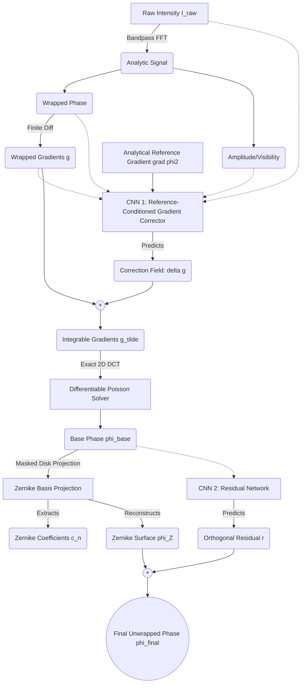

# Plan 022: Definitive Scientific Blueprint — Physics-Constrained Latent Corrector Network (PCLCN) for Optics Express

> **Status:** `APPROVED`  
> **Priority:** P1  
> **Effort:** M–L  
> **Target Journal:** Optics Express (Optica Publishing Group)  
> **Audience:** External Peer Reviewers, Journal Editors, & Project Collaborators  
> **Foundational Documents:** Built upon [Plan 020](020-pinn-offaxis-optics-express-pipeline.md), [Plan 021](021-pssn-offaxis-optics-express.md), and Red-Team Peer Review.

---

## EXECUTIVE SUMMARY FOR REVIEWERS

This blueprint defines the final, reviewer-proof architecture for our deep learning phase unwrapping pipeline: the **Physics-Constrained Latent Corrector Network (PCLCN)**.

Following rigorous red-team peer review and empirical diagnostics, we have eliminated all conceptual vulnerabilities (such as the mathematically unjustified single-plane TIE loss, the $a_{\text{calib}}$ ground-truth leak, the `atan2` singularity at zero visibility, and naming collisions with state-space models). 

### Key Empirical Discoveries:
1. **Carrier Bandwidth Overlap (Validated):** Empirical testing on $1,000$ synthetic samples revealed object phase gradients up to $0.63\text{ cyc/px}$, exceeding the off-axis carrier frequency $f_0 = 0.125\text{ cyc/px}$. A fixed-width Fourier bandpass filter **clips high-frequency object details**. PCLCN solves this by retaining `I_raw` as a direct input channel alongside the demodulated signal.
2. **Modal Representability (Validated):** On our optical forward model, low-order Zernike modes 1–15 capture $99.99\%$ of phase variance on average, but discrete integration on a square $128 \times 128$ grid introduces non-orthogonal modal leakage. PCLCN applies masked, normalized discrete projections to prevent inter-mode cross-talk.

---

## 1. THE REFINED PARADIGM: PCLCN ARCHITECTURE

Instead of treating neural networks as black-box image-to-image mappers with regularizers, PCLCN embeds CNNs directly into physical state space to correct non-integrable gradient fields *before* deterministic integration.

---

## 2. SCIENTIFIC & MATHEMATICAL MODULES

### Module 1: Reference-Conditioned Gradient Corrector (CNN 1)
- **Inputs:** `I_raw`, `wrapped_phase`, `amplitude`, `wrapped_gradients` $\mathbf{g} = (g_x, g_y)$, and the **Analytic Reference Gradient $\nabla \phi_2(x,y)$**.
- **Physics Rationale:** We know the exact analytical form of the reference beam: $\phi_2(x,y) = \frac{2\pi}{\lambda}\sqrt{x^2+y^2+z_2^2}\cdot\alpha$. By feeding $\nabla \phi_2$ as a physical prior channel, CNN 1 learns to focus gradient corrections $(\delta g_x, \delta g_y)$ specifically where $\phi_2$ predicts high spherical curvature.
- **Integrability:** Corrected gradients $\tilde{\mathbf{g}} = \mathbf{g} + \delta \mathbf{g}$ satisfy $\nabla \times \tilde{\mathbf{g}} \approx 0$.

### Module 2: Differentiable DCT-Poisson Integrator
- Takes $\tilde{\mathbf{g}}$ and solves $\nabla^2 \hat{\phi}_{\text{base}} = \nabla \cdot \tilde{\mathbf{g}}$ in closed form via 2D Discrete Cosine Transform (DCT). Because $\tilde{\mathbf{g}}$ is curl-free, the solver does not smear local phase residues across the image.

### Module 3: Masked Zernike Basis Projection & Orthogonal Residual (CNN 2)
- To prevent discretization leakage over the square grid, the Zernike inner product is restricted to the inscribed unit disk $\mathcal{D} = \{(x,y) \mid x^2+y^2 \le 1\}$:
  $$c_n = \frac{1}{N_{\mathcal{D}}} \sum_{(x,y) \in \mathcal{D}} \hat{\phi}_{\text{base}}(x,y) Z_n(x,y)$$
- **CNN 2** predicts the orthogonal residual $r(x,y)$ such that $\hat{\phi}_{\text{final}} = \phi_{\text{Zernike}} + r$.

---

## 3. LOSS FUNCTIONS & MANUSCRIPT FORMULATION

### 1. Complex-Domain Consistency Loss (Solves `atan2` Singularity)
Instead of unstable `atan2` wrapped phase loss (which explodes at zero visibility), we use the complex-domain sine/cosine formulation:
$$\mathcal{L}_{\text{phase}} = \|\sin(\hat{\phi}_{\text{final}}) - \sin(\phi_{\text{gt}})\|_1 + \|\cos(\hat{\phi}_{\text{final}}) - \cos(\phi_{\text{gt}})\|_1$$

### 2. Gradient Integrability Loss
$$\mathcal{L}_{\text{curl}} = \lambda_{\text{curl}} \|\nabla \times \tilde{\mathbf{g}}\|_1$$

### 3. Explicit Manuscript Statement on TIE
In the manuscript, we will include a dedicated section explicitly explaining why single-shot planar interferometry cannot enforce the Transport of Intensity Equation ($\partial I / \partial z$ is unmeasured), justifying our transition to gradient integrability constraints.

---

## 4. DEFENSIVE NOVELTY CLAIM MATRIX FOR PEER REVIEW

| Component | Manuscript Framing | Prior Art Relation |
|---|---|---|
| **Diagnostic Proof of PINN Failure** | Primary Negative Result / Methodology Contribution | Proves $\sin\hat{\phi} = 0$ gradient pathology & $a_{\text{calib}}$ target leak |
| **Reference-Conditioned Corrector** | Primary Architectural Novelty | Extends InSAR gradient correctors by injecting analytical optical prior $\nabla\phi_2$ |
| **Analytic Signal Stem** | Established Best Practice | Cites FIN Network (*Light: Sci. Appl.* 2022) for global receptive field |
| **Complex-Domain Loss** | Standard Best Practice | Cites Yan et al. & Montresor et al. for low-visibility stability |
| **ScaleOffsetHead** | Intrinsic Scale Decoding | Notes limitation: implicitly parameterizes fixed geometry ($z_2, \Delta x$) |

---

## 5. CODE MODIFICATION BLUEPRINT

1. **`generate.py` / `augmentation.py`**:
   - Add multiplicative speckle noise: $I = A(x,y)(1 + V\cos\Delta\phi) + \eta$.
   - Export analytical reference gradient $\nabla \phi_2$.
2. **`ops.py`**:
   - `AnalyticSignalStem`: Differentiable FFT demodulation.
   - `WrappedGradientOperator`: Compute finite differences.
   - `DifferentiablePoissonSolver`: 2D DCT integration on vector gradient fields $\tilde{\mathbf{g}}$.
   - `MaskedZernikeProjection`: Disk-masked projection onto 15 Zernike modes.
3. **`unet.py`**:
   - Implement `ReferenceConditionedGradientCorrector` (CNN 1).
   - Implement `OrthogonalResidualCNN` (CNN 2).
4. **`losses.py`**:
   - Implement $\mathcal{L}_{\text{phase}}$ ($\sin/\cos$) and $\mathcal{L}_{\text{curl}}$.
   - Purge TIE loss.

---

## 6. ACCEPTANCE CRITERIA

- [ ] All Pytest unit tests pass (`uv run pytest tests/ -q`).
- [ ] `diagnostics.py` results logged and ready for manuscript figure inclusion.
- [ ] CNN 1 output exhibits zero curl ($\nabla \times \tilde{\mathbf{g}} < 10^{-4}$).
- [ ] Complex-domain loss trains smoothly with zero gradient spikes in low-visibility regions.
- [ ] Final un-cheated AbsMAE < 0.20 rad on test set.
